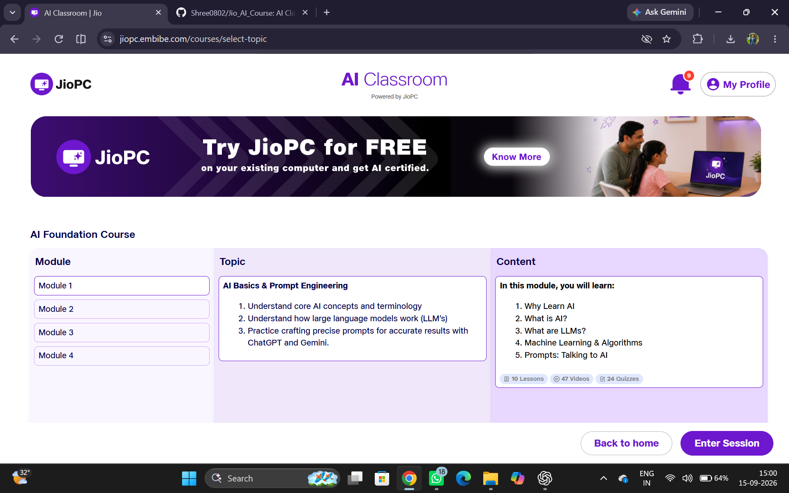
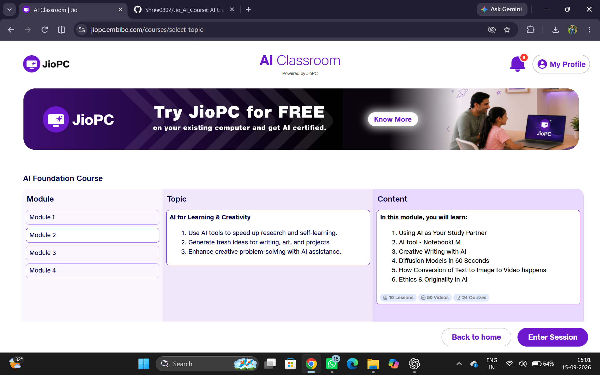
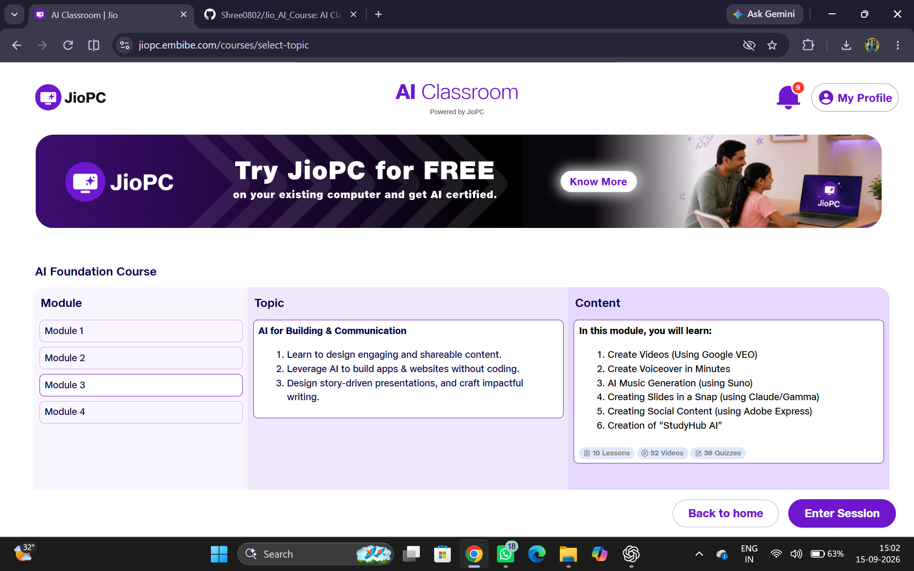
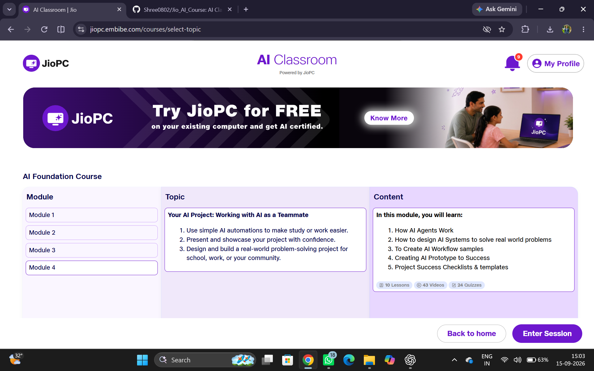
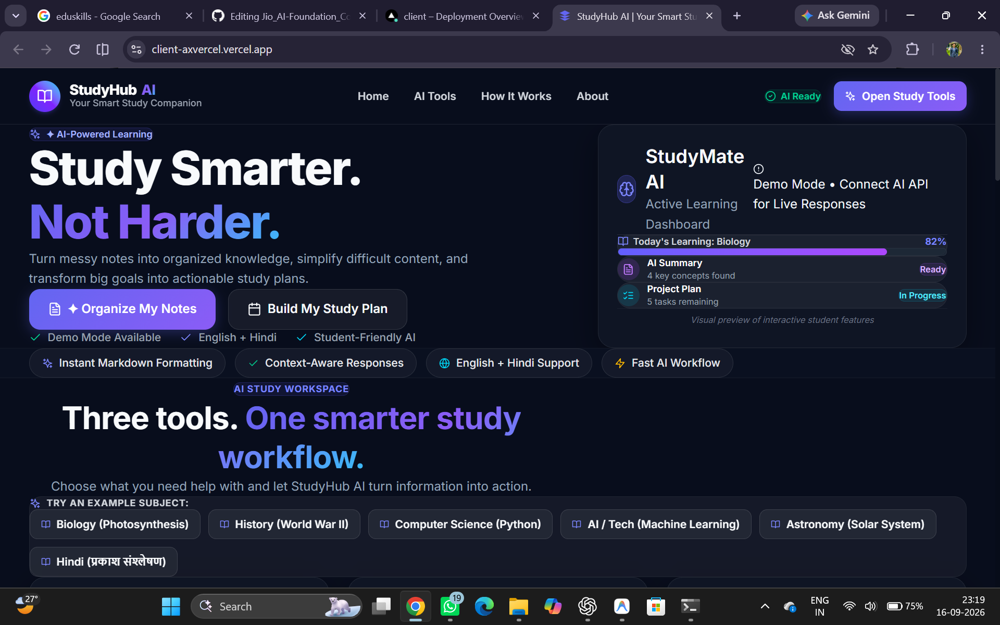
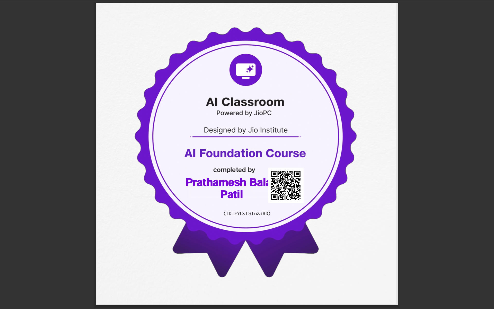
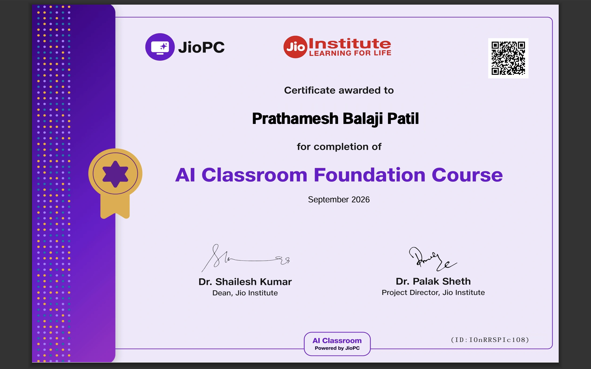

# 🤖 Jio AI Classroom Foundation Course

<p align="center">
  <b>Learn AI. Explore AI Tools. Build with AI.</b>
</p>

<p align="center">
  AI Classroom Foundation Course by <b>Jio Institute & JioPC</b>, designed to help students and beginners develop practical AI skills and understand how AI can be used for learning, creativity, productivity, communication, and real-world projects.
</p>

---

## 📌 About the Course

The **AI Classroom Foundation Course** provides a beginner-friendly introduction to Artificial Intelligence with hands-on learning using modern AI tools such as **ChatGPT, Gemini, NotebookLM, Adobe Express**, and more.

The course covers AI fundamentals, prompt engineering, creative AI, AI-powered communication, automation, AI agents, and project development.

### 🎯 What You'll Learn

- 🧠 Fundamentals of Artificial Intelligence
- 💬 Prompt Engineering & LLMs
- 📚 AI for Learning & Research
- 🎨 AI-powered Creativity & Content Creation
- 🚀 AI Tools for Building & Communication
- ⚙️ AI Automation & AI Agents
- 💡 Real-world AI Problem Solving
- 🛠️ Building and Presenting an AI Project

---

# 📚 Course Modules

## 🧠 Module 1: AI Basics & Prompt Engineering

Learn the fundamentals of AI, Machine Learning, and Large Language Models while developing effective prompting skills using tools like **ChatGPT and Gemini**.

**Topics include:**
- What is AI?
- Large Language Models (LLMs)
- Machine Learning & Algorithms
- Prompt Engineering
- Effective AI Communication



---

## 🎨 Module 2: AI for Learning & Creativity

Discover how AI can become a powerful study and creative partner for research, self-learning, writing, brainstorming, and content creation.

**Topics include:**
- AI as a Study Partner
- NotebookLM
- Creative Writing with AI
- Text-to-Image & Video
- AI Ethics & Originality



---

## 🚀 Module 3: AI for Building & Communication

Explore AI tools for creating engaging digital content, presentations, videos, voiceovers, music, websites, and social media content.

**Topics include:**
- AI Video Generation
- AI Voiceovers
- AI Music Generation
- AI Presentation Creation
- Social Media Content
- No-Code AI Applications



---

## 🤖 Module 4: Your AI Project

Apply your AI knowledge to a practical project. Learn how AI agents, workflows, and AI systems can be designed to solve real-world problems.

**Topics include:**
- How AI Agents Work
- AI System Design
- AI Workflows & Automation
- Building an AI Prototype
- Project Success Checklist
- Presenting Your AI Project



---

## Final Project
# 📚 StudyHub AI

### Your Smart Study Companion

StudyHub AI is an AI-powered learning companion that helps students organize notes, summarize learning material, and transform large goals into actionable study plans.

## 🚀 Live Demo

👉 [Visit StudyHub AI](https://client-axvercel.vercel.app/)




# 🛠️ Tools Explored

<p align="center">

`ChatGPT` • `Gemini` • `NotebookLM` • `Adobe Express` • `Google Veo` • `Suno` • `Claude` • `Gamma`

</p>

---

# 🎓 Learning Outcome

By completing this course, learners gain a strong foundation in **AI concepts, AI tools, prompt engineering, creative AI, automation, and practical AI project development**.

> 💡 **Learn AI → Experiment with AI → Build with AI**

---

---

## 🏆 Certification & Achievement

### 🎓 JioPC AI Classroom Foundation Course

Successfully completed the **AI Classroom Foundation Course**, powered by JioPC and designed by Jio Institute.

The course provided hands-on learning in **Artificial Intelligence, Prompt Engineering, AI Tools, Creativity, Automation, AI Agents, and Real-World AI Projects.**

### 🎖️ JioPC Completion Badge


---

### 📜 Certificate of Completion




## 🚀 Key Takeaway

> **Learn AI → Explore AI Tools → Build with AI → Solve Real-World Problems**

---

## 📂 Repository Structure

```
Jio_AI_Course/
│
├── 📄 README.md
├── 🖼️ Module01.png
├── 🖼️ Module02.png
├── 🖼️ Module03.png
├── 🖼️ Module04.png
├── 🏅 JioPC_Badge.png
└── 📜 Certificate.png

